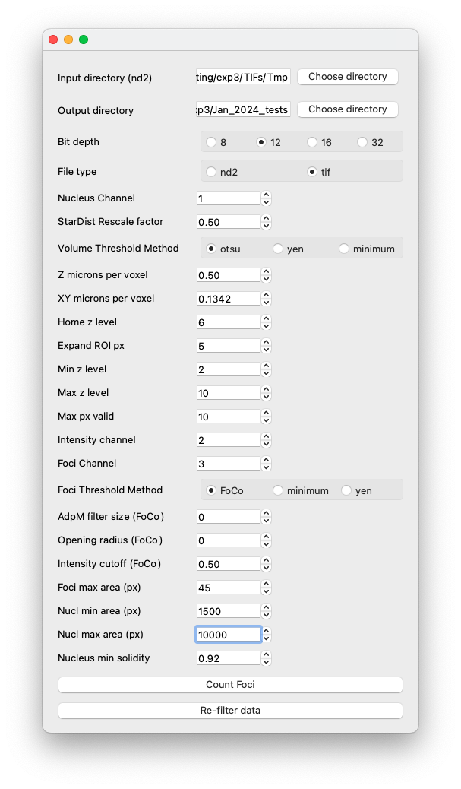

# foci_counting

(0) Install Anaconda

(1) Create a conda environment with python v3.9: 

`conda create --name foci_counting python=3.9`  

(2) Install dependencies listed in the requirements.txt file:

`conda activate foci_counting`  
`pip install -r requirements.txt`

(3) Execute the application:

`conda activate foci_counting`  
`python foci_counting.py`

